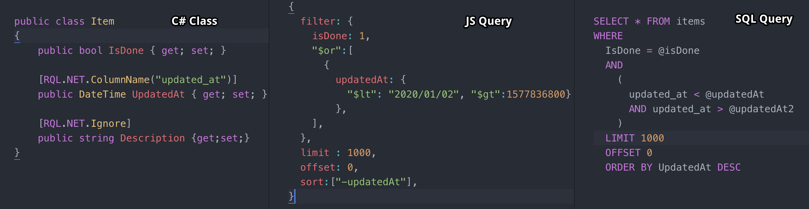

# RQL.NET
 [](https://wakatime.com/badge/github/Ashtonian/RQL.NET)

`RQL.NET` is a resource query language for .NET intended for use with web apps. It provides a simple, hackable api for creating dynamic sql queries from user submitted JSON. It is intended to sit between a web application and a SQL based database. It converts user-submitted JSON query structures (inspired by mongodb query syntax) to sql queries, handling validation and type conversions. It was inspired by and is a port of [rql (golang)](https://github.com/a8m/rql). Its primary purpose is to generate complex where clauses `is_done = 1 OR (updated_at < X AND updated_at > Y) OR ... ` while validating their types. 

<p align="center">
  
</p>

## Why

When creating a simple CRUD API it's often a requirement to provide basic collection filtering functionality. Without implementing some other heavy layer (graphql, odata, ef), usually, I would end up having to write code to support each field for a given class. A common solution is adding a query parameter for each field, and when using aggregate functions having a separate composite parameter for that aggregate ie `?updated_at_gt=x&updated_at_lt=y`. Outside of that being cumbersome for lots of fields, this begins to totally breakdown when needing to apply a disjunction between two conditions using aggregate functions, something like `SELECT * FROM TABLE WHERE is_done = 1 OR (updated_at < X AND updated_at > Y)`. So to deal with this I ported one of my favorite libraries from go. The result is a control point that validates types and range of filters as well as allowing the use to enter complex filters. 


## Getting Started

### Basic

Client side json input:

```javascript
var rqlExpression = {
  filter: {
    "isDone": 1,
    "$or":[
        {"updatedAt": {"$lt": "2020/01/02", "$gt":1577836800}},
      ],
  },
  limit : 1000,
  offset: 0,
  sort:["-updatedAt"],
}
```

C#:

```c#
var (dbExpression, errs) = RqlParser.Parse<TestClass>(rqlExpression);
if(errs != null) { /*handle me*/ }

Assert.True(dbExpression.Filter = "IsDone = @isDone AND ( UpdatedAt < @updatedAt AND UpdatedAt > @updatedAt2 )");
Assert.True(dbExpression.Limit == 1000);
Assert.True(dbExpression.Offset == 0);
Assert.True(dbExpression.Sort == "UpdatedAt DESC");
Assert.Equal(result.Parameters["@isDone"], true);
Assert.Equal(result.Parameters["@updatedAt"], new DateTime(2020, 01, 02));
Assert.Equal(result.Parameters["@updatedAt2"], new DateTime(2020, 01, 01));
```

Alternatives:

```c#
// Alternatively you can use a generic instance
IRqlParser<TestClass> genericParser = new RqlParser<TestClass>();
(dbExpression, err) = genericParser.Parse(rqlExpression);

// Alternatively you can use a non-generic instance
var classSpec = new ClassSpecBuilder().Build(typeof(TestClass));
IRqlParser parser = new RqlParser(classSpec);
(dbExpression, err) = parser.Parse(rqlExpression);

// Alternatively parse a `RqlExpression` object
var rqlExpression = new RqlExpression
{
  Filter = new Dictionary<string, object>()
  {
    ["isDone"] = 1,
    ["$or"] = new List<object>()
    {
      new Dictionary<string, object>(){
        ["updatedAt"] = new Dictionary<string,object>(){
            ["$lt"] = "2020/01/02",
            ["$gt"] = 1577836800
        }
      }
    },
  },
  Limit = 1000,
  Offset = 0,
  Sort = new List<string>() { "-updatedAt" },
};
(dbExpression, err) = RqlParser.Parse<TestClass>(rqlExpression);
```

### Integration Examples

#### Web Api

```c#
[HttpPost("api/rql")]
public async void Rql([FromBody] dynamic rqlIn)
{
  var (dbExpression, _) = parser.Parse((rqlIn as object).ToString());
}
```

#### ADO Command

```c#
 using (var connection = await _connectionFactory.GetConnection())
using (SqlCommand command = new SqlCommand())
{
  command.CommandText = $"SELECT * FROM TestClass WHERE ${dbExpression.Filter} LIMIT ${dbExpression.Limit} OFFSET ${dbExpression.Offset} ORDER BY ${dbExpression.Sort}";
  command.Parameters.AddRange(dbExpression.Parameters.Select(x => new SqlParameter(x.Key, x.Value)).ToArray());
  using (var reader = command.ExecuteReader())
  {
      // do stuff
  }
}
```

#### Dapper

```c#
using (var connection = await _connectionFactory.GetConnection())
{
  connection.Open();
  var parameters = new DynamicParameters(dbExpression.Parameters);
  var sql = $"SELECT * FROM TestClass WHERE ${dbExpression.Filter} LIMIT ${dbExpression.Limit} OFFSET ${dbExpression.Offset} ORDER BY ${dbExpression.Sort}";
  var results = await connection.QueryAsync<TestClass>(sql, parameters);
  // do stuff
}
```

#### Dapper SimpleCRUD

```c#
using (var connection = await _connectionFactory.GetConnection())
{
  connection.Open();
  var parameters = new DynamicParameters(dbExpression.Parameters);
  var page = Utility.GetPage(dbExpression.Offset, dbExpression.Limit);
  var where = $"WHERE {dbExpression.Filter}";
  var results = (await connection.GetListPagedAsync<TestClass>(page,dbExpression.Limit, where, dbExpression.Sort, parameters)).ToList();
  // do stuff
}
```

### Common Customizations

```c#
public class SomeClass
{
  // prevents operations
  [RQL.NET.Ops.Disallowed("$like", "$eq")]
  // overrides column namer
  [RQL.NET.ColumnName("type")]
  // overrides (json) namer
  [RQL.NET.FieldName("type")]
  // ignores entirely
  [RQL.NET.Ignore.Sort]
  // prevents sorting
  [RQL.NET.Ignore]
  // prevents filtering
  [RQL.NET.Ignore.Filter]
  public string SomeProp { get; set; }
}
```

### RQL Operations

  | RQL Op  | SQL Op |           Json Types |
  | :------ | :----: | -------------------: |
  | `$eq`   |  `=`   | number, string, bool |
  | `$neq`  |  `!=`  | number, string, bool |
  | `$lt`   |  `<`   |         number, bool |
  | `$gt`   |  `>`   |         number, bool |
  | `$lte`  |  `<=`  |         number, bool |
  | `$gte`  |  `>=`  |         number, bool |
  | `$like` | `like` |             string[] |
  | `$in`   |  `in`  |   number[], string[] |
  | `$nin`  | `nin`  |   number[], string[] |
  | `$or`   |  `or`  |                   [] |
  | `$not`  | `not`  |                   {} |
  | `$and`  | `and`  |                   {} |
  | `$nor`  |   -    |                  n/a |

## Hackability

This library was structured to be a highly configurable parser. Most of the parser's components can be overridden directly or via a delegate or interface implementation via the [`Defaults`](RQL.NET/Defaults.cs) class. Most notably [`Defaults.DefaultConverter`](RQL.NET/Defaults.cs) and [`Defaults.DefaultValidator`](RQL.NET/DefaultTypeValidator.cs). Additionally, many of the data structures and internal builders are exposed to enable this package to be used as a library. You could also implement a [custom class specification](RQL.NET/ClassSpecBuilder.cs), [field specification](RQL.NET/ClassSpecBuilder.cs), and [operation mapper](RQL.NET/IOpMapper.cs) to add pretty heavy customizations including custom types and operations.

```c#
public static class Defaults
{
    public static string SortSeparator = ",";
    public static string Prefix = "$";
    public static int Offset = 0;
    public static int Limit = 10000;
    public static Func<IParameterTokenizer> DefaultTokenizerFactory = () => new NamedTokenizer();
    public static Func<string, Type, object, IError> DefaultValidator = DefaultTypeValidator.Validate;
    public static Func<string, string> DefaultColumnNamer = x => x;
    public static Func<string, string> DefaultFieldNamer = x => {...};
    public static IOpMapper DefaultOpMapper = new SqlMapper();
    public static ClassSpecCache SpecCache = new InMemoryClassSpecCache();
    public static Func<string, Type, object, (object, IError)> DefaultConverter =
        (fieldName, type, raw) =>
        {
          ...
        };
}
```

## Note on Performance

The parser uses reflection and by **default** it's done once per class and cached. Additionally when using the typed parse commands `Parse<T>(RqlExpression exp)` and `Parse(RqlExpression exp)` there is a redundant JSON serialization and then deserialization because this was built piggybacking off the JContainer tree structure from JSON.NET. To avoid this penalty use the `Parse<T>(string exp)` and `Parse(string exp)` calls.

## Release TODO

- [ ] better coverage
  - [ ] case: all attributes
  - [ ] case: all ops
- [ ] fix stricter validation - right side init object is and, or/nor is array
- [ ] fix empty object validation  ashtonian/RQL.NET#1
- [ ] typed more actionable errors
- [ ] share/publish

## vNext

[See #6](https://github.com/Ashtonian/RQL.NET/issues/6)
